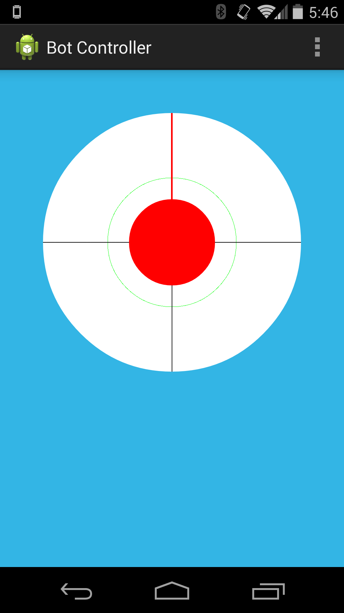
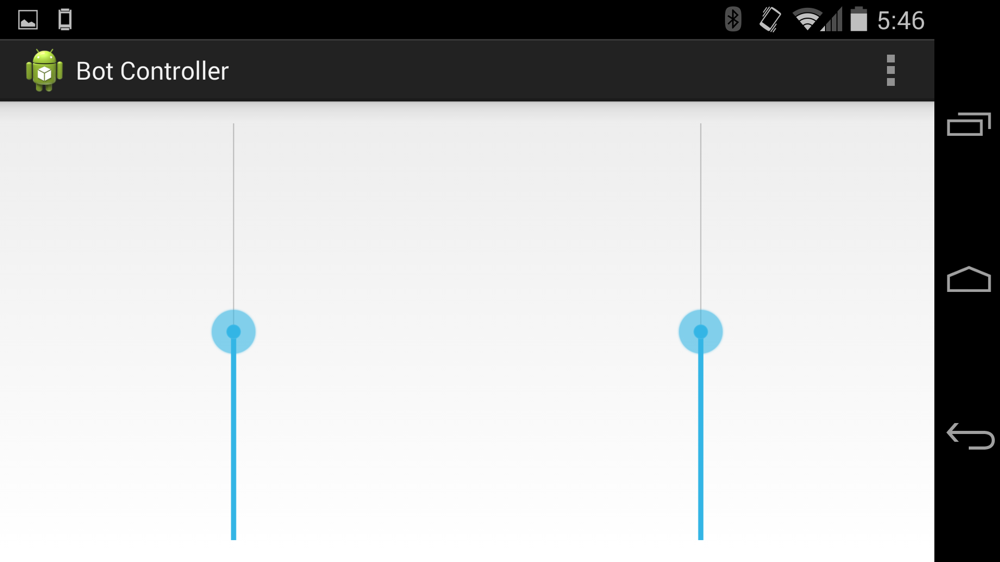

hexabot
=======
A custom firmware for the [Wild Thumper Controller](https://www.sparkfun.com/products/retired/11057)
and an Android application to drive the controller.
The Android app communicates with the controller using Bluetooth with a [IOIO board](https://github.com/ytai/ioio/wiki)

Hardware Setup
---------------
* Connect Pin7(UART TX) on the IOIO board to D0 pin (towards chip) on controller.
* Connect any GND pin on the IOIO board to any GND pin on controller. 

Compiling firmware
-------------------
* Compile the firmware by running `make`
* Edit the `Makefile` and make sure the `UARTPORT` is set to the appropriate serial device
* Flash the firmware by running `make flash`

Android application
---------------------
* Open with Android Studio and run as usual.
* Portrait orientation will present the user with a Joystick
* Landscape orientation will present the user with tank tracks

